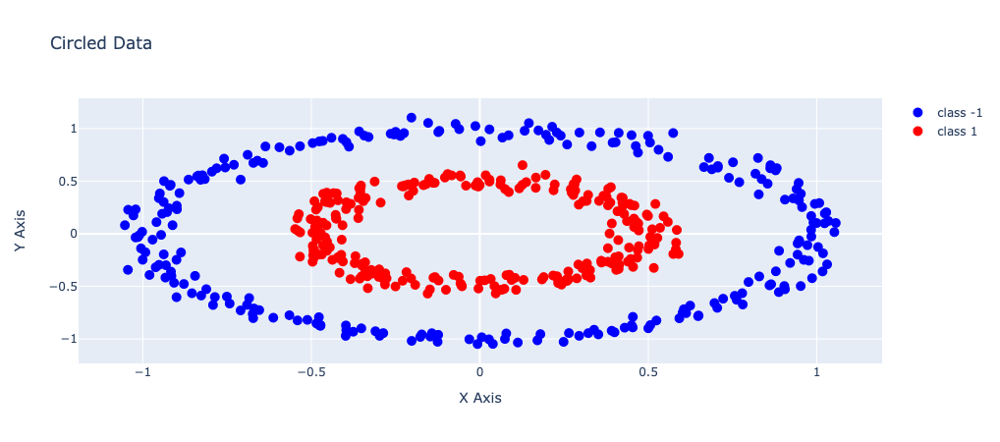
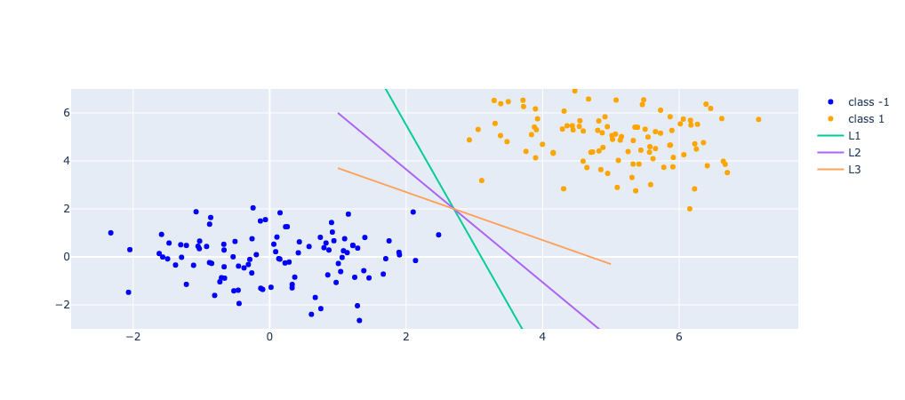
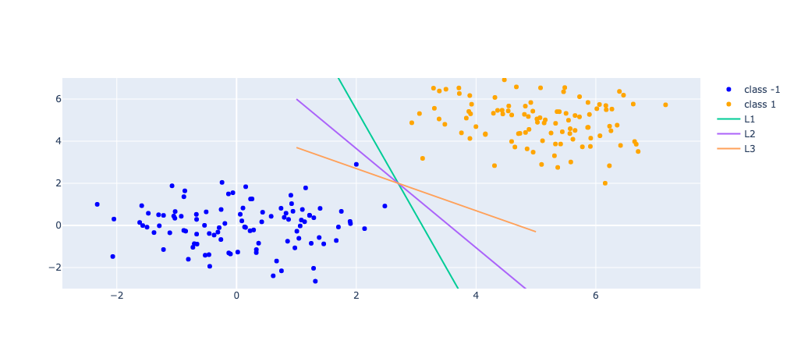
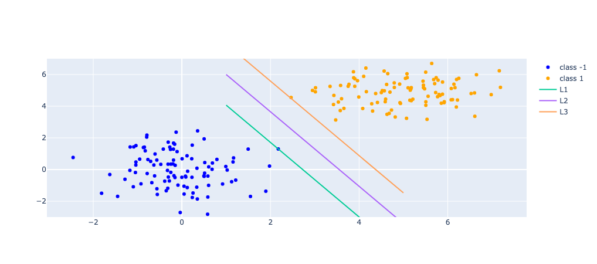

# Support Vector Machine

*Thanks to Vladimir Vapnik.*

## Linear Model

Classification problem:

Linear separable *vs* Non-linear separable

Non-linear separable classes:

Linear separable classes:

In the example above, there are two classes that can be separated by a linear line. In a 3-D dimension or higher dimension, the linear separable classes are separated by a plane(s) or hyperplane(s).

As it can be seen, there are more than one hyperplane, in fact infinite hyperplanes, that can separate the two classes. Three are shown in the figure. Now we come to the question which of these hyperplanes is the best to separate those classes?

To answer this question, we need to define several metrics of merits.

The first one comes to our interests is the error tolorance. Suppose there was an error in measuring the coordinats of one data point in the first class, then the line L3 would not be able to discriminate this data point to the right class. This is said the error tolerance (Or for the unseen data point, the highest possibility that hyperplane can discriminate it correctly)

Second metrix that comes to our discussion is that the preference of hyperplane to the two classes with no error made in the measurement. It is obviouse that L1 and L3 have different affinities to the two classes.

Thereby, L2 seems the best option for our classification problem. But how to find the L2?

In the figure above, lines L1, L2, and L3 are parallel. The distance between L1 and L3 is $d$ which is called **margin**, and the distences between L1 and L2, L3 and L2 are the same, $\frac{d}{2}$.

Our goal is to find the L2 which maximize the distance between L1 and L3, i.e. $\max(d)$. The vctors that the line L1 and L3 cross are called support vectors. In this example, each vector is two dimensional, $x_i = \begin{pmatrix} x_{i1} \\ x_{i2}\end{pmatrix}$.

## Support Vector

First, let us define the linear separable training set $(x_1, y1), (x_2, y_2), (x_3, y_3), ..., (x_N, y_N)$ with $x_i$ as the i-th sample and $y_i$ as the label of i-th sample with values -1 or 1.

Second, set the linear modle parameters $(w, b)$, so the hyperplane can be written as

$$
w^Tx + b = 0
$$

where $w$ has the same dimension as $x$, and $b$ is a constant.

Next, as the training set is linear separable

$\{(x_i, y_i)\}_{i=1...N}$

then we have

$$
\exists (w, b),\; for\;\; \forall i=1...N \\
a.\;\; if\;\; y_i = +1 \Rightarrow w^Tx_i+b \ge 0\\
b.\;\; if\;\; y_i = -1 \Rightarrow w^Tx_i+b < 0
$$

or we can simplify it as:

$$
\begin{align*}
&y_i[w^Tx_i + b]\ge0
\end{align*}
$$

Now we have the optimization problem: $maximize\;(d)$ which is equivalent to:

$$
\begin{align}
&\min\;\;\frac{1}{2}||w||^2\\
&s.t.\;\; y_i[w^Tx_i+b]\ge1\;\;(i=1...N)
\end{align}
$$

Apparently, this is a quadratic programming convex optimization problem and the constraints are linear. Then the the problem is either has no solution or one optimal of minimal solution.

To 

fact.1: $w^Tx+b=0$ and $aw^Tx+ab=0$ are the same hyperplane for $a\in R^+$, if $(w, b)$ satisfy equation (1), then $(aw, ab)$ also satisfy equation (1).

fact. 2: distance between a point $(x_0, y_0)$ from a plane $w_1x+w_2y+b=0$ is

$$
d=\frac{|w_1x_0+w_2y_0+b}{\sqrt{w_1^2+w_2^2}}=\frac{w^Tx+b}{||w||}
$$

where in this example $w=\begin{vmatrix}w_1\\w_2\end{vmatrix}$, $x=\begin{vmatrix}x_0\\y_0\end{vmatrix}$, then the distance from a point $x_0$ to the hyperplane $w^Tx+b=0$ is:

$$
d=\frac{|w^Tx+b|}{||w||}
$$

Then, by adjusting parameter $a$: $(w, b)$ $\to$ $(aw, ab)$, we can have:

$$
|w^Tx_0+b|=1
$$

on all support vectors $x_0$ (note: 1 on the right side is due to the fact that the class of the vector $x_0$ is either '+1' or '-1')

The distance from support vector to this hyper plane is

$$
d=\frac{|w^Tx+b|}{||w||}=\frac{1}{||w||}
$$

or

$$
d_{SupportVector}=\frac{1}{||w||}
$$

To maximize $d$ $\iff$to minimize $||w||$

    Note: why$y_i[w^Tx_i+b]\ge1$?

1. for the support vectors, we have the $d=1$
2. for the non support vectors, distance $d>1$

    i.e. for the i-th vector

$$
\begin{align}
 &d_i = \frac{|w^Tx_i+b|}{||w||} \ge d_{SupportVector}\\
\iff &\frac{|w^Tx_i+b|}{||w||} \ge \frac{1}{||w||}\\
\iff & |w^Tx_i +b| \ge 1\\
\iff & y_i[w^Tx_i+b] \ge 1
\end{align}
$$

* *this is bottom*
