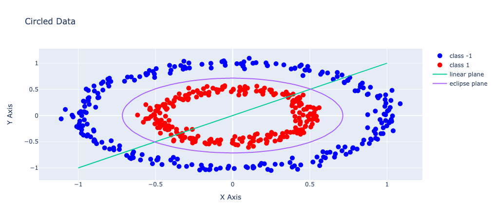

# Support Vector Machine II for Non-linear Classification

## Optimization problem

Prime problem:

$$
minimize\quad \frac{1}{2}||w||^2+C\sum_{i=1}^N \xi_i\quad (i=1...N)\\
s.t. \quad y_i[w^Tx_i+b]\ge 1-\xi_i\\
$$

where $\xi_i \ge 0$ is slack variable and $\displaystyle C\sum_{i=1}^N\xi_i$ is regulation termn with pre-set parameter $C$ to balance the weights of $w$ and $\xi_i$

Note: for large enough $\xi_i$, constraint (1) will always be satisfied but the optimization will be divergent. To avoid it, we add term $\displaystyle C\sum_{i=1}^N\xi_i$ in the objective function so that $\xi_i$ are restricted to not too large value.

As seen in the figure bellow, the non-linear separable classes cannot be discriminated by a linear hyperplane.

To resolve the non-linear separable problem we project the vector to a higher dimension

$$
X\xrightarrow{\varphi} \varphi(X)
$$

Now the question is which $\varphi$ should we choos?

$\varphi(x)$ is of infinite dimension, and **we dont need to know the exact form of $\varphi(x)$**, we only need to know a kernel function:

$$
K(x_1, x_2) = \varphi(x_1)^T\varphi(x_2)
$$

then the optimization problem is solvalble.

## Kernel Function

Common used kernel functions:

**Gaussian kernel function**

$$
\begin{align}
K(x_1, x_2)&=e^{\frac{||x_1-x_2||^2}{2\sigma^2}}\\
&=\varphi(x_1)^T\varphi(x_2)
\end{align}
$$

where $\varphi(x)$ is of infinite dimension

**Polynormial kernel function**

$$
\begin{align}
K(x_1)(x_2) &=(x_1^Tx_2+1)^d\\
&=\varphi(x_1)^T\varphi(x_2)
\end{align}
$$

where $\varphi(x)$ has definite dimension

However, the kernel function $K(x_1, x_2)$ must satisfy certain constraint so that $K(x_1, x_2)=\varphi(x_1)^T\varphi(x_2)$

The necessary and sufficient condition is:

Mercer's Theorem

for $\forall C_i, x_i\quad(i=1...N)$ we have

$$
\begin{align}
&K(x_1, x_2)=K(x_2, x_1)\\
&\sum_{i=1}^N\sum_{j=1}^NC_iC_jK(x_i, x_j)\ge 0
\end{align}
$$

(where the second condition is called **positive semi-definiteness)**

The the optimization problem now can be written as

$$
\begin{align}
minimize\quad &\frac{1}{2}||w||^2 + C\sum_{i=1}^N\xi_i\\
s.t.\quad &y_i[w^T\varphi(x_i)+b]\ge 1-\xi_i\quad\\
&\xi_i \ge 0\\
\end{align}
$$

$$
K(x_i, x_j)=\varphi(x_i)^T\varphi(x_j)
$$

with $i=1...N$ and we know $K(x_i, x_j)$ but do not know $\varphi(x)$

To solve this problem, we need to review the **prime problem** and the **dual problem**.

If we have the prime problem as:

$$
\begin{align}
minimize\quad &f(w)\\
s.t.\quad &g_i(w)\le 0\quad(i=1...K)\\
&h_i(w)=0\quad(i=1...M)
\end{align}
$$

we can set (Lagrangian)

$$
\begin{align}
L(w, \alpha, \beta) &= f(w)+\sum^K_{i=1}\alpha_ig_i(w) + \sum^M_{i=1}\beta_ih_i(w)\\
L(w,\alpha, \beta) &=f(w)+\alpha^Tg(w)+\beta^Th(w)
\end{align}
$$

Then its dual problem is

$$
\begin{align}
Maximize\quad \theta(\alpha, \beta) &= \underset{\text{all\ w}}{inf}\{L(w, \alpha, \beta)\}\\
s.t.\quad \alpha_i &\ge 0\quad(i=1...K)\\
\end{align}\\
(\alpha\ge0)
$$

where $\underset{\text{all\ w}}{inf}$ means to calculate the minimal for all $w$. So the objective function of dual problem is to find the maximal of the minimal $L(w, \alpha, \beta)$ for all $w$ with given $(\alpha, \beta)$.

Here, we need to introduce a theorem: **if $w^{\ast}$ is solution of the prime problem and $\alpha^{\ast}$, $\beta^{\ast}$ are the solution of dual problem, then we have** $f(w^{\ast})\ge\theta(\alpha^{\ast}, \beta^{\ast})$

$$
\begin{align*}
\theta(\alpha^{\ast}, \beta^{\ast}) &= \underset{\text{all w}}{inf}{L(w^{\ast}, \alpha^{\ast}, \beta^{\ast})}\\
&\le L(w^{\ast}, \alpha^{\ast}, \beta^{\ast})\\
&= f(w^{\ast}) + \sum^K_{i=1}\alpha_{i}^{\ast}g_i(w^{\ast})+\sum^M_{i=1}\beta_{i}^{\ast}h_{i}(w^{\ast})\\
&\le f(w^{\ast})
\end{align*}
$$

From (21) to (22), for $w^{\ast}$ is prime problem's solution, then the constraints must be satisfied:

$$
\begin{cases}
g_i(w^{\ast})&\le0\\
h_i(w^{\ast})&=0\\
\alpha^{\ast}_i&\ge 0
\end{cases}
$$

Now, let's define a duality gap function between prime problem and its dual problem

$$
G=f(w^{\ast})-\theta(\alpha^{\ast}, \beta^{\ast})\ge 0
$$

According to the **Strong duality theorem**,

> $f(w)$ is convex function, $g(w)=Aw+b$ and $h(w)=Cw+d$ are linear, then the duality gap of the optimization problem is 0.
>
> i.e. with $w^*$ is solution of prime proble, $\alpha^{\ast}$ and $\beta^{\ast}$ are solutions of dual problem, we have $f(w^{\ast})=\theta(\alpha^{\ast}, \beta^{\ast})$

Thereby,

$$
\begin{align*}
\theta(\alpha^{\ast}, \beta^{\ast}) &= \underset{\text{all w}}{inf}{\{L(w, \alpha^{\ast}, \beta^{\ast})\}}\\
&\le L(w^{\ast}, \alpha^{\ast}, \beta^{\ast})\\
&= f(w^{\ast}) + \sum^K_{i=1}\alpha_{i}^{\ast}g_i(w^{\ast})+\sum^M_{i=1}\beta_{i}^{\ast}h_{i}(w^{\ast})\\
\end{align*}
$$

then for $\forall i = 1...K$, we'll have solution that is either $\alpha^{\ast}=0$ or $g^{\ast}_i(w^{\ast})=0$. This is called **KKT Theorem**.

But for the optimization problem we have:

$$
\begin{align}
minimize\quad &\frac{1}{2}||w||^2 +C\sum^N_{i=1}\xi_i\\
s.t.\quad &y_i[w^T\varphi(x_i)+b] \ge 1-\xi_i\quad\\
&\xi_i\ge 0
\end{align}\\
where\quad i=1...K
$$

in which the constraintare different: the (18) and (19) inequalities are a '$\ge0$' not '$\le0$' and '$=0$', respectively.

So we reform the formulars (27) and (28) as:

$$
1+\xi_i -y_iw^T\varphi(x_i)-y_ib\le0\\
\xi_i\le0
$$

here we set the $\xi_i$ to $-\xi_i$.

Thus, the dual problem is

$$
\begin{align}
maximize\quad &\theta(\alpha, \beta )= \underset{{all(w,\xi_i,b)}}{inf}\{\frac{1}{2}||w||^2-C\sum^N_{i=1}{\xi_i} + \sum^N_{i=1}\beta_i\xi_i + \sum^N_{i=1}\alpha_i[1+\xi_i-y_iw\varphi(x_i)-y_ib]\}\\
s.t.\quad &\alpha_i\ge0\\
&\beta_i\ge 0
\end{align}
$$

Note: in the objective function, the term $\frac{1}{2}||w||^2-C\sum^N_{i=1}\xi_i$ corresponds to $f(w)$, the rest part corresponds to $g_i(w)$. The $\beta_i$ and $\alpha_i$ in the objective function correspond to the $\alpha_i$ that is in the equation (14). And the $w$ of $f(w)$ in (12) corresponds to $(w,\xi_i, b) $ here in (29).

According to KKT theorem

$$
\begin{cases}
\displaystyle\frac{\partial L}{\partial w}=0\\
\\
\displaystyle\frac{\partial L}{\partial \xi_i} = 0\\
\\\
\displaystyle\frac{\partial L}{\partial b} =0
\end{cases}\iff
\begin{cases}
\displaystyle\frac{\partial L}{\partial w} = w-\sum^N_{i=1}\alpha_iy_i\varphi(x_i)=0\\
\\
\displaystyle\frac{\partial L}{\partial \xi_i} = -C + \beta_i + \alpha_i = 0\\
\\
\displaystyle\frac{\partial L}{\partial b} = \sum^N_{i=1}\alpha_i y_i=0
\end{cases}
\iff
\begin{cases}
\displaystyle w=\sum^N_{i=1}\alpha_iy_i\varphi(x_i)\\
\\
\displaystyle \alpha_i + \beta_i = C\\
\\
\displaystyle \sum^N_{i=1}\alpha_i y_i = 0
\end{cases}
$$

Plugin back to the objective function $\theta(\alpha, \beta)$

$$
\theta(\alpha, \beta) = \underset{all (w, \alpha, \beta)}{inf}\{\frac{1}{2}||w||^2 - C\sum^N_{i=1}\xi_i + \sum^N_{i=1}\beta_i\xi_i + \sum^N_{i=1}\alpha_i[1+\xi_i - y_iw^T\varphi(x_i) -y_ib]\}
$$

let $C=\beta_i + \alpha_i$, we can cancel the terms that have $\xi_i$. for the $||w||^2$ we have

$$
\begin{align}
\frac{1}{2}||w||^2 &= \frac{1}{2}w^Tw\\
&=\frac{1}{2}(\sum^N_{i=1}\alpha_iy_i\varphi(x_i))^T(\sum^N_{j=1}\alpha_jy_j\varphi_j(x_j))\\
&=\frac{1}{2}\sum^N_{i=1}\sum^N_{j=1}\alpha_i\alpha_jy_iy_j\varphi(x_i)^T\varphi(x_j)\\
&= K(x_i, x_j)
\end{align}
$$

for the $\displaystyle-\sum^N_{i=1}\alpha_iy_iw^T\varphi(x_i)$, we have

$$
\begin{align}
-\sum^N_{i=1}\alpha_iy_iw^T\varphi(x_i) &= -\sum^N_{i=1}\alpha_iy_i(\sum^N_{j=1}\alpha_jy_j\varphi(x_j))^T\varphi(x_i)\\
&= -\sum^N_{i=1}\sum^N_{j=1}\alpha_i\alpha_jy_iy_j\varphi(x_j)^T\varphi(x_i)\\
&=K(x_j, x_i) = K(x_i, x_j)
\end{align}
$$

so that

$$
\theta(\alpha, \beta) = \sum^N_{i=1}\alpha_i - \frac{1}{2}\sum^N_{i=1}\sum^N_{j=1}\alpha_i\alpha_jy_iy_j\varphi(x_i)^T\varphi(x_j)\quad\quad\\
=\sum^N_{i=1}\alpha_i - \frac{1}{2}\sum^N_{i=1}\sum^N_{j=1}\alpha_i\alpha_jy_iy_jK(x_i, x_j)
$$

Then the dual problem becomes:

$$
\begin{align}
Maximize\quad &\theta(\alpha, \beta) = \sum^N_{i=1}\alpha_i - \frac{1}{2}\sum^N_{i=1}\sum^N_{j=1}\alpha_i\alpha_jy_iy_jK(x_i, x_j)\\
s.t. \quad &0\le \alpha_i \le C\\
&\sum^N_{i=1}\alpha_iy_i=0
\end{align}
$$

Solving this problem will solve the SVM problem.

The algorithm to solve find $\{\alpha_i\}$ is **'[SMO Algorithm](../SVM/SMO Algorithm.md)'**

NOTE: **Why we only need to know the $K(x_i, x_j)$ and do not need to know the exact form of $\varphi(x_i)$. Knowing we have $\varphi(x_i)$ in the $w$:**

$$
w=\sum^N_{i=1}\alpha_iy_i\varphi(x_i)
$$

EXPLANATION:

Let say we have test data set $X$, then

$$
\begin{cases}
if \quad w^T\varphi(X) + b \ge 0 \Rightarrow y=+1\\
if \quad w^T\varphi(X) + b < 0 \Rightarrow y=-1
\end{cases}
$$

and

$$
\begin{align}
w^T\varphi(X) &= [\sum^N_{i=1}\alpha_iy_i\varphi(x_i)]^T\varphi(x)\\
&=\sum^N_{i=1}\alpha_iy_i\varphi(x_i)\varphi(x)\\
&=\sum^N_{i=1}\alpha_iy_iK(x_i, x)
\end{align}
$$

Thereby, we only need to know the kernel function.

But how to obtain $b$?

According to KKT theorem,

$$
\forall i=1...K,\quad \alpha^*_i = 0\quad or \quad g^*_i(w^*)=0\\
\iff \forall i=1...N \quad \beta_i=0\quad or \quad \xi_i=0\;\;\\
i.e. \quad \alpha_i=0 \quad or \quad 1+\xi_i-y_iw^T\varphi(x_i)-y_ib=0
$$

To find $b$, let take an $\alpha_{i}$ that is $0 < \alpha_{i} < C$

$$
\Rightarrow \beta_i=C-\alpha_i >0\;\; (\beta_i \ne 0)\\
\Rightarrow \xi_i = 0
$$

Since $\alpha_i \ne 0$

$$
\Rightarrow 1 + \xi_i - y_iw^T\varphi(x_i)-y_ib=0
$$

Take $\xi_i=0$ into account

$$
\Rightarrow 1 - y_iw^T\varphi(x_i) - y_ib = 0\quad\quad\quad\quad\quad\quad\quad\\
\begin{align}\Rightarrow  b &= \frac{1-y_iw^T\varphi(x_i)}{y_i}\\
&=\frac{1-y_i\displaystyle\sum^N_{j=1}\alpha_jy_j(\varphi(x_j))^T\varphi(x_i)}{y_i}\quad\quad\\
&=\frac{1-y_i\displaystyle\sum^N_{j=1}\alpha_jy_jK(x_j,x_i)}{y_i}
\end{align}
$$

## Summary

### Step 1: training

Input training data set $\{(x_i, y_i)\}_{i=1...N}$, with optimization problem:

$$
\begin{align}
maximize\quad &\theta(\alpha)=\sum^N_{i=1}\alpha_i - \frac{1}{2}\sum^N_{i=1}\sum^N_{j=1}\alpha_i\alpha_jy_iy_jK(x_i, x_j)\\
s.t. \quad &0\le \alpha_i\le C\\
&\sum^N_{i=1}\alpha_iy_i=0
\end{align}
$$

With SMO algorithm finding the $\{\alpha_i\}$

To find $b$, take one $0<\alpha_i<C$, then

$$
b=\frac{1-y_i\sum^N_{j=1}\alpha_jy_jK(x_j,x_i)}{y_i}
$$

### Step 2: test

Input test data set $\{x\}$

$$
\begin{cases}
if\quad \sum^N_{i=1}\alpha_iy_iK(x_i,x)+b\ge 0, \quad then \quad y=+1\\
if\quad \sum^N_{i=1}\alpha_iy_iK(x_i,x)+b<0, \quad then \quad y=-1
\end{cases}
$$
